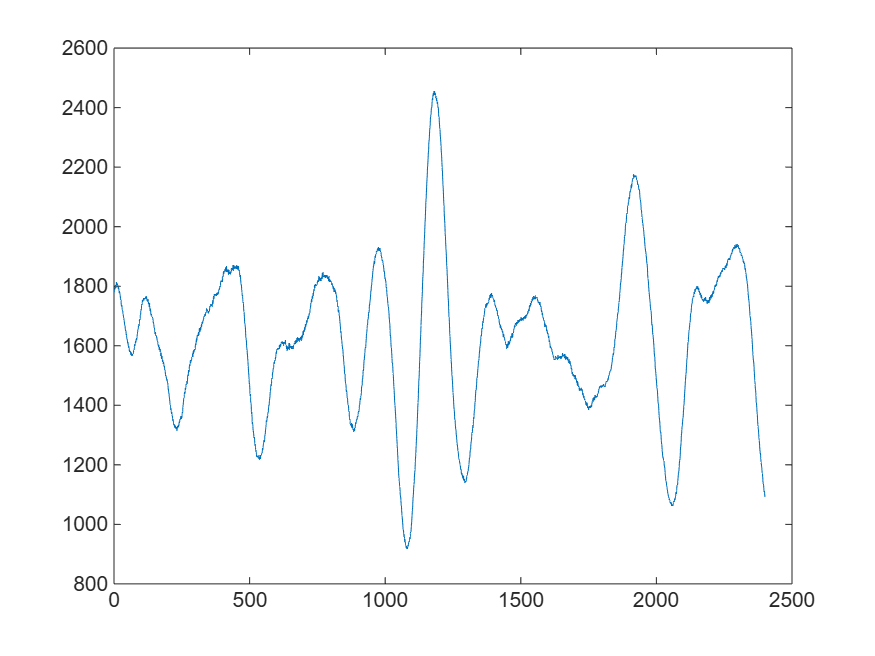

# Python interop
# Connect to Python
```matlab
!which python
```

```matlabTextOutput
/usr/bin/python
```

```matlab
!python --version
```

```matlabTextOutput
Python 3.10.16
```

```matlab
pyenv(Version="/usr/bin/python")
```

```matlabTextOutput
ans = 
  PythonEnvironment with properties:

          Version: "3.10"
       Executable: "/usr/bin/python"
          Library: "libpython3.10.so.1.0"
             Home: "/usr"
           Status: NotLoaded
    ExecutionMode: OutOfProcess

```

# Call Python from MATLAB
## Via a live task
```matlab
% Python code input
pycode = [...
"import math",...
"res = math.sqrt(42)",...
"print(res)"...
];

try
    [res] = pyrun(pycode, ...
         [ "res" ])
catch ME
    % Clear temporary variables from workspace and from Python
    clear pycode;
    rethrow(ME)
end
```

```matlabTextOutput
6.48074069840786
res = 6.4807
```

```matlab

% Clear temporary variables from workspace and from Python
clear pycode;
res^2
```

```matlabTextOutput
ans = 42
```

## Via the py. prefix
```matlab
py.math.sqrt(42)
```

```matlabTextOutput
ans = 6.4807
```

# Call Python packages
## Astropy
```matlab
websave("get-pip.py","https://bootstrap.pypa.io/get-pip.py");
!python get-pip.py
!python -m pip --version
!python -m pip install astropy
```

```matlab
% Import the Astropy Time module
astropy_time = py.importlib.import_module('astropy.time');

% Create a Time object from a string
time_str = '2023-10-01T12:00:00';
time_obj = astropy_time.Time(time_str)
```

```matlabTextOutput
time_obj = 
  Python Time with properties:

                T: [1x1 py.astropy.time.core.Time]
            cache: [1x1 py.collections.defaultdict]
    delta_ut1_utc: [1x1 py.numpy.ndarray]
           format: [1x4 py.str]
        in_subfmt: [1x1 py.str]
             info: [1x1 py.astropy.time.core.TimeInfo]
         isscalar: 1
              jd1: 2460219
              jd2: 0
         location: [1x1 py.NoneType]
             mask: [1x1 py.numpy.ndarray]
           masked: 0
             ndim: [1x1 py.int]
       out_subfmt: [1x1 py.str]
        precision: [1x1 py.int]
            scale: [1x3 py.str]
            shape: [1x0 py.tuple]
             size: [1x1 py.int]
         unmasked: [1x1 py.astropy.time.core.Time]
            value: [1x23 py.str]
        writeable: 1
           SCALES: [1x7 py.tuple]

    2023-10-01T12:00:00.000

```

```matlab
time_obj.to_datetime
```

```matlabTextOutput
ans = datetime
   01-Oct-2023 12:00:00

```

## Obspy
```matlab
!python -m pip install obspy
```

```matlabTextOutput
Defaulting to user installation because normal site-packages is not writeable
Requirement already satisfied: obspy in /home/matlab/.local/lib/python3.10/site-packages (1.4.1)
Requirement already satisfied: numpy>=1.20 in /home/matlab/.local/lib/python3.10/site-packages (from obspy) (2.2.4)
Requirement already satisfied: scipy>=1.7 in /home/matlab/.local/lib/python3.10/site-packages (from obspy) (1.15.2)
Requirement already satisfied: matplotlib>=3.3 in /home/matlab/.local/lib/python3.10/site-packages (from obspy) (3.10.1)
Requirement already satisfied: lxml in /home/matlab/.local/lib/python3.10/site-packages (from obspy) (5.3.1)
Requirement already satisfied: setuptools in /usr/lib/python3/dist-packages (from obspy) (68.1.2)
Requirement already satisfied: sqlalchemy<2 in /home/matlab/.local/lib/python3.10/site-packages (from obspy) (1.4.54)
Requirement already satisfied: decorator in /home/matlab/.local/lib/python3.10/site-packages (from obspy) (5.2.1)
Requirement already satisfied: requests in /usr/lib/python3/dist-packages (from obspy) (2.31.0)
Requirement already satisfied: contourpy>=1.0.1 in /home/matlab/.local/lib/python3.10/site-packages (from matplotlib>=3.3->obspy) (1.3.1)
Requirement already satisfied: cycler>=0.10 in /home/matlab/.local/lib/python3.10/site-packages (from matplotlib>=3.3->obspy) (0.12.1)
Requirement already satisfied: fonttools>=4.22.0 in /home/matlab/.local/lib/python3.10/site-packages (from matplotlib>=3.3->obspy) (4.56.0)
Requirement already satisfied: kiwisolver>=1.3.1 in /home/matlab/.local/lib/python3.10/site-packages (from matplotlib>=3.3->obspy) (1.4.8)
Requirement already satisfied: packaging>=20.0 in /home/matlab/.local/lib/python3.10/site-packages (from matplotlib>=3.3->obspy) (24.2)
Requirement already satisfied: pillow>=8 in /home/matlab/.local/lib/python3.10/site-packages (from matplotlib>=3.3->obspy) (11.1.0)
Requirement already satisfied: pyparsing>=2.3.1 in /usr/lib/python3/dist-packages (from matplotlib>=3.3->obspy) (3.1.1)
Requirement already satisfied: python-dateutil>=2.7 in /usr/lib/python3/dist-packages (from matplotlib>=3.3->obspy) (2.8.2)
Requirement already satisfied: greenlet!=0.4.17 in /home/matlab/.local/lib/python3.10/site-packages (from sqlalchemy<2->obspy) (3.1.1)
```

```matlab
% Python code input
pycode2 = [...
"from obspy import UTCDateTime",...
"from obspy.clients.fdsn import Client",...
"",...
"# Initialize the FDSN client to connect to IRIS",...
"client = Client(""IRIS"")",...
"",...
"# Define the time period for the data (one minute of data)",...
"starttime = UTCDateTime(""2020-01-01T00:00:00"")",...
"endtime = starttime + 60  # 60 seconds later",...
"",...
"# Retrieve the waveform data",...
"st = client.get_waveforms(network=""IU"", station=""ANMO"", location=""00"", channel=""BHZ"",",...
"                          starttime=starttime, endtime=endtime)",...
"",...
"data = st.traces[0].data"...
];

try
    [data, st] = pyrun(pycode2, ...
         [ "data" "st" ])
catch ME6
    % Clear temporary variables from workspace and from Python
    clear pycode2;
    rethrow(ME6)
end
```

```matlabTextOutput
data = 
  Python ndarray:

   1779   1790   1790   1792   1804   1800   1794   1803   1813   1806   1803   1808   1806   1805   1800   1791   1797   1793   1778   1782   1780   1773   1768   1757   1755   1752   1735   1733   1736   1723   1720   1718   1709   1704   1698   1693   1686   1681   1673   1667   1666   1652   1651   1649   1637   1638   1628   1621   1621   1609   1609   1610   1597   1594   1598   1588   1580   1583   1581   1581   1577   1570   1579   1574   1566   1573   1570   1568   1572   1571   1576   1580   1584   1585   1593   1603   1600   1606   1613   1610   1612   1624   1625   1621   1633   1640   1645   1652   1658   1662   1668   1673   1669   1686   1690   1687   1704   1705   1717   1723   1722   1738   1736   1741   1753   1747   1753   1758   1752   1754   1760   1760   1757   1761   1761   1760   1764   1760   1758   1764   1760   1751   1754   1750   1755   1756   1741   1745   1741   1731   1743   1735   1718   1724   1721   1704   1703   1706   1699   1696   1696   1694   1694   1686   1677   1677   1671   1659   1659   1655   1640   1645   1646   1635   1637   1634   1628   1628   1619   1616   1615   1607   1601   1596   1602   1595   1586   1593   1579   1581   1586   1568   1574   1576   1558   1559   1566   1552   1547   1552   1543   1539   1544   1536   1528   1529   1520   1518   1513   1500   1501   1496   1493   1487   1483   1486   1476   1475   1467   1455   1450   1442   1438   1426   1421   1411   1401   1401   1386   1390   1384   1371   1377   1368   1364   1356   1347   1352   1345   1334   1337   1336   1327   1334   1334   1326   1328   1325   1320   1325   1322   1313   1324   1329   1324   1325   1333   1331   1329   1343   1344   1343   1353   1352   1356   1361   1355   1364   1363   1356   1372   1377   1375   1393   1403   1409   1423   1425   1428   1443   1439   1441   1458   1454   1459   1472   1470   1476   1482   1474   1484   1502   1500   1500   1517   1517   1514   1532   1536   1532   1545   1550   1543   1547   1551   1551   1562   1562   1566   1573   1564   1579   1583   1575   1582   1583   1588   1589   1587   1599   1606   1604   1616   1623   1615   1623   1635   1635   1634   1634   1643   1645   1635   1647   1659   1649   1648   1653   1660   1655   1659   1671   1664   1672   1680   1674   1678   1683   1686   1688   1695   1700   1699   1700   1706   1705   1701   1710   1714   1713   1721   1725   1724   1718   1717   1716   1709   1710   1712   1716   1716   1717   1730   1733   1732   1738   1738   1736   1734   1736   1740   1732   1742   1752   1741   1751   1766   1757   1761   1773   1770   1771   1772   1772   1772   1769   1775   1773   1770   1776   1777   1771   1778   1781   1777   1784   1790   1791   1790   1797   1801   1799   1812   1818   1814   1817   1816   1820   1816   1816   1833   1831   1840   1848   1842   1851   1850   1850   1856   1853   1861   1863   1847   1852   1865   1852   1850   1856   1848   1855   1855   1839   1848   1855   1843   1844   1846   1840   1847   1848   1843   1852   1861   1853   1855   1861   1855   1870   1868   1853   1866   1871   1863   1861   1864   1865   1859   1864   1866   1860   1862   1869   1868   1857   1864   1868   1858   1864   1867   1854   1850   1853   1844   1833   1835   1837   1822   1808   1807   1800   1789   1778   1768   1769   1755   1744   1746   1726   1714   1711   1691   1678   1672   1666   1650   1629   1624   1618   1600   1589   1583   1569   1556   1546   1530   1513   1505   1488   1472   1473   1449   1432   1437   1414   1407   1399   1374   1377   1360   1337   1341   1330   1314   1312   1303   1292   1293   1292   1274   1265   1270   1254   1245   1249   1234   1229   1231   1228   1229   1226   1225   1230   1228   1220   1226   1223   1219   1233   1224   1220   1232   1231   1233   1236   1239   1240   1248   1256   1251   1263   1271   1272   1284   1281   1278   1294   1303   1306   1319   1325   1336   1350   1344   1350   1363   1360   1369   1377   1378   1392   1400   1401   1415   1421   1428   1446   1450   1460   1471   1465   1476   1492   1488   1500   1511   1512   1524   1524   1528   1544   1540   1544   1552   1550   1559   1558   1565   1580   1574   1584   1589   1589   1590   1586   1593   1590   1589   1590   1593   1602   1592   1598   1604   1598   1604   1606   1612   1611   1609   1615   1609   1606   1607   1611   1603   1600   1611   1606   1610   1608   1608   1618   1603   1603   1601   1592   1597   1584   1587   1596   1586   1596   1592   1591   1608   1589   1588   1607   1595   1593   1597   1596   1597   1591   1599   1599   1591   1597   1599   1593   1590   1600   1601   1602   1609   1606   1615   1613   1606   1618   1619   1610   1613   1625   1618   1613   1628   1625   1618   1624   1618   1619   1623   1615   1620   1627   1627   1629   1622   1628   1632   1619   1628   1636   1629   1636   1649   1642   1639   1653   1648   1652   1663   1652   1663   1673   1664   1668   1672   1683   1685   1679   1691   1691   1693   1700   1693   1697   1703   1708   1708   1709   1724   1728   1733   1744   1745   1755   1749   1747   1767   1759   1761   1778   1770   1781   1789   1784   1801   1798   1793   1807   1804   1802   1805   1803   1803   1803   1809   1815   1814   1820   1819   1817   1833   1828   1820   1829   1826   1825   1820   1824   1827   1818   1830   1827   1830   1843   1827   1836   1846   1835   1832   1835   1837   1833   1837   1833   1829   1835   1832   1830   1836   1837   1833   1836   1833   1826   1830   1829   1819   1829   1833   1815   1821   1823   1814   1819   1818   1814   1816   1812   1805   1810   1806   1800   1800   1791   1798   1796   1781   1787   1792   1782   1788   1787   1777   1782   1770   1768   1764   1747   1752   1737   1731   1734   1714   1714   1719   1708   1698   1693   1680   1673   1660   1645   1649   1633   1622   1618   1605   1597   1589   1586   1570   1562   1549   1536   1534   1508   1505   1504   1480   1474   1472   1457   1446   1449   1435   1424   1424   1410   1401   1401   1391   1379   1381   1360   1351   1354   1337   1335   1337   1329   1330   1339   1327   1324   1334   1327   1319   1319   1320   1311   1317   1321   1315   1322   1323   1334   1341   1337   1345   1351   1352   1352   1359   1363   1361   1370   1378   1380   1378   1388   1400   1400   1415   1424   1421   1430   1434   1442   1462   1463   1470   1489   1489   1502   1520   1517   1532   1552   1554   1564   1576   1589   1595   1593   1607   1624   1637   1642   1658   1670   1671   1687   1691   1697   1712   1709   1721   1737   1740   1751   1756   1768   1782   1785   1799   1803   1813   1827   1832   1845   1854   1861   1868   1872   1883   1884   1877   1893   1902   1897   1906   1909   1911   1917   1915   1918   1923   1926   1921   1922   1931   1922   1919   1927   1919   1919   1927   1918   1915   1916   1906   1900   1898   1892   1885   1887   1885   1876   1870   1866   1858   1847   1849   1838   1825   1828   1820   1817   1808   1794   1796   1779   1767   1761   1751   1741   1732   1730   1720   1707   1693   1681   1675   1651   1633   1633   1612   1594   1590   1576   1558   1542   1541   1529   1507   1500   1478   1462   1451   1430   1412   1400   1388   1371   1355   1339   1318   1304   1288   1268   1254   1235   1218   1203   1184   1163   1154   1143   1131   1127   1109   1095   1093   1079   1064   1059   1042   1029   1022   1009    998    982    980    974    960    965    954    941    950    940    934    932    922    926    919    919    924    918    928    927    927    935    939    945    941    954    956    951    972    971    973    992   1001   1012   1030   1046   1054   1075   1093   1101   1121   1133   1143   1165   1174   1184   1211   1225   1238   1264   1280   1297   1319   1340   1362   1389   1409   1425   1457   1481   1494   1520   1547   1565   1595   1623   1638   1668   1694   1711   1744   1764   1782   1816   1834   1848   1881   1898   1920   1953   1965   1992   2016   2029   2059   2082   2097   2115   2140   2157   2173   2198   2208   2228   2246   2255   2283   2292   2301   2326   2332   2345   2366   2372   2379   2394   2400   2402   2420   2430   2427   2443   2448   2442   2455   2453   2444   2455   2450   2442   2447   2435   2437   2438   2423   2430   2427   2413   2417   2407   2399   2399   2377   2368   2366   2345   2333   2327   2311   2295   2287   2269   2251   2239   2217   2199   2184   2161   2141   2129   2103   2080   2068   2038   2023   2010   1980   1966   1947   1926   1914   1889   1870   1855   1832   1812   1787   1764   1753   1725   1699   1694   1670   1642   1630   1608   1592   1575   1554   1542   1522   1504   1494   1479   1461   1443   1432   1418   1398   1387   1381   1359   1350   1348   1328   1321   1317   1303   1294   1283   1272   1266   1258   1248   1246   1235   1223   1221   1215   1211   1208   1200   1197   1186   1184   1185   1169   1169   1173   1161   1159   1166   1156   1152   1161   1149   1147   1150   1142   1140   1140   1145   1143   1143   1151   1154   1162   1166   1167   1175   1177   1181   1189   1194   1202   1217   1222   1224   1243   1251   1252   1268   1279   1282   1296   1309   1307   1318   1332   1326   1344   1359   1355   1376   1385   1388   1409   1415   1432   1449   1452   1457   1469   1490   1494   1499   1515   1523   1535   1548   1549   1558   1572   1581   1591   1601   1607   1613   1628   1637   1635   1653   1661   1657   1672   1683   1677   1685   1695   1696   1705   1711   1720   1728   1727   1734   1738   1729   1733   1742   1736   1737   1743   1742   1742   1747   1746   1750   1759   1755   1762   1769   1763   1771   1773   1761   1768   1777   1770   1767   1769   1766   1762   1759   1757   1757   1749   1747   1752   1741   1735   1735   1731   1729   1727   1725   1718   1718   1720   1706   1701   1704   1698   1691   1690   1688   1674   1672   1674   1661   1660   1667   1662   1655   1655   1657   1653   1646   1647   1646   1630   1632   1639   1627   1627   1627   1619   1615   1613   1608   1602   1606   1603   1592   1596   1603   1598   1593   1606   1616   1605   1602   1611   1610   1609   1617   1620   1618   1628   1633   1627   1628   1638   1642   1630   1629   1643   1643   1643   1652   1658   1659   1667   1666   1665   1676   1672   1672   1677   1669   1674   1681   1675   1676   1685   1684   1679   1685   1687   1680   1683   1689   1684   1686   1689   1688   1695   1693   1686   1693   1690   1688   1692   1685   1690   1694   1690   1697   1695   1698   1700   1691   1700   1702   1695   1702   1701   1700   1708   1707   1707   1714   1713   1713   1721   1717   1719   1734   1735   1729   1738   1742   1736   1744   1750   1746   1755   1754   1753   1762   1754   1757   1765   1759   1761   1763   1757   1763   1768   1758   1758   1764   1762   1761   1761   1762   1756   1752   1752   1745   1744   1744   1747   1746   1740   1746   1745   1735   1732   1734   1729   1716   1718   1713   1705   1707   1699   1694   1693   1688   1684   1686   1677   1666   1674   1673   1667   1664   1668   1666   1651   1654   1653   1642   1643   1644   1635   1629   1632   1624   1613   1616   1611   1600   1593   1594   1597   1589   1590   1589   1580   1580   1577   1571   1567   1563   1561   1556   1552   1554   1555   1552   1556   1565   1562   1558   1559   1559   1558   1557   1555   1557   1568   1565   1558   1561   1563   1560   1560   1565   1560   1557   1564   1564   1558   1560   1565   1561   1565   1574   1571   1565   1568   1565   1566   1571   1560   1566   1572   1555   1557   1563   1561   1557   1557   1563   1554   1555   1561   1550   1549   1548   1543   1554   1551   1540   1545   1547   1537   1535   1536   1523   1524   1522   1506   1510   1507   1498   1503   1503   1500   1496   1495   1500   1491   1490   1500   1491   1487   1491   1481   1478   1483   1471   1468   1479   1473   1464   1462   1465   1458   1450   1458   1455   1452   1453   1450   1451   1457   1457   1449   1453   1450   1435   1439   1439   1428   1426   1431   1424   1418   1421   1413   1414   1411   1401   1411   1411   1400   1408   1407   1392   1391   1395   1386   1385   1393   1397   1397   1394   1397   1397   1391   1394   1399   1396   1396   1405   1410   1415   1418   1419   1425   1418   1414   1426   1423   1418   1433   1434   1427   1431   1432   1427   1427   1429   1427   1432   1437   1437   1442   1444   1448   1455   1457   1458   1464   1464   1462   1465   1464   1459   1462   1465   1464   1466   1464   1465   1466   1466   1471   1467   1463   1463   1464   1462   1463   1471   1472   1475   1481   1479   1478   1481   1481   1482   1489   1489   1488   1498   1500   1502   1508   1510   1516   1515   1517   1520   1521   1530   1535   1540   1548   1557   1561   1569   1575   1572   1582   1596   1594   1600   1623   1624   1629   1645   1650   1657   1663   1678   1689   1694   1707   1708   1714   1727   1735   1746   1751   1760   1776   1786   1799   1811   1814   1826   1836   1848   1862   1870   1881   1889   1901   1915   1924   1936   1943   1960   1971   1968   1985   2004   2011   2012   2018   2036   2046   2043   2051   2068   2069   2075   2082   2084   2099   2098   2096   2113   2120   2119   2123   2127   2141   2141   2133   2148   2153   2155   2163   2160   2168   2175   2169   2166   2167   2170   2171   2169   2167   2171   2170   2164   2158   2157   2157   2149   2141   2140   2142   2138   2127   2122   2124   2119   2103   2093   2089   2084   2073   2056   2054   2045   2031   2024   2014   2012   2002   1994   1990   1975   1966   1961   1946   1934   1927   1919   1915   1906   1898   1886   1875   1874   1859   1835   1826   1820   1805   1791   1780   1771   1761   1753   1743   1729   1722   1719   1711   1693   1672   1672   1666   1645   1638   1633   1620   1609   1597   1579   1565   1562   1545   1522   1517   1507   1494   1484   1470   1460   1455   1444   1428   1411   1405   1401   1382   1365   1356   1348   1336   1318   1310   1309   1302   1282   1271   1269   1252   1242   1232   1225   1225   1217   1217   1214   1199   1192   1191   1175   1163   1155   1145   1145   1136   1129   1125   1116   1114   1105   1100   1097   1091   1091   1086   1082   1083   1076   1072   1072   1070   1073   1066   1063   1069   1063   1063   1064   1061   1070   1076   1075   1075   1075   1086   1086   1084   1090   1094   1109   1109   1104   1119   1132   1132   1133   1145   1158   1169   1174   1180   1194   1208   1215   1220   1235   1257   1264   1276   1297   1306   1320   1331   1337   1351   1358   1366   1382   1396   1405   1422   1439   1452   1468   1482   1495   1503   1514   1531   1549   1560   1571   1588   1606   1614   1620   1635   1649   1654   1662   1674   1679   1686   1705   1710   1712   1727   1736   1740   1746   1756   1759   1759   1767   1764   1765   1781   1775   1774   1789   1783   1786   1791   1792   1793   1794   1801   1794   1791   1798   1797   1789   1791   1793   1780   1779   1782   1774   1770   1776   1776   1765   1762   1768   1764   1756   1757   1756   1753   1757   1752   1749   1754   1755   1759   1756   1752   1759   1763   1758   1752   1751   1752   1748   1741   1748   1751   1744   1747   1751   1753   1743   1751   1762   1753   1754   1764   1768   1762   1760   1766   1772   1765   1765   1775   1778   1782   1776   1778   1785   1787   1790   1795   1803   1799   1798   1805   1806   1802   1805   1817   1819   1817   1823   1828   1833   1832   1828   1834   1835   1832   1832   1834   1843   1845   1842   1849   1849   1851   1853   1849   1854   1860   1859   1858   1860   1861   1858   1855   1856   1864   1869   1865   1862   1862   1869   1875   1868   1874   1882   1885   1891   1888   1889   1892   1890   1894   1891   1889   1897   1900   1901   1905   1907   1910   1909   1916   1922   1918   1920   1925   1929   1929   1931   1927   1927   1936   1933   1929   1929   1937   1940   1930   1936   1939   1941   1941   1933   1936   1937   1927   1929   1927   1927   1927   1915   1912   1914   1912   1912   1902   1903   1905   1899   1897   1893   1892   1885   1879   1883   1880   1875   1876   1865   1856   1858   1851   1845   1838   1828   1825   1817   1810   1804   1791   1779   1768   1758   1753   1743   1730   1718   1702   1696   1691   1680   1667   1654   1643   1630   1620   1603   1584   1571   1558   1548   1543   1528   1510   1495   1483   1470   1455   1449   1433   1411   1406   1394   1377   1369   1352   1336   1329   1319   1307   1291   1282   1273   1258   1246   1239   1235   1221   1208   1202   1195   1186   1171   1167   1160   1142   1136   1134   1123   1109   1110   1106   1092

    Use details function to view the properties of the Python object.

    Use int32 function to convert to a MATLAB array.

st = 
  Python Stream with properties:

    traces: [1x1 py.list]

    1 Trace(s) in Stream:
    IU.ANMO.00.BHZ | 2020-01-01T00:00:00.019538Z - 2020-01-01T00:00:59.994538Z | 40.0 Hz, 2400 samples

```

```matlab

% Clear temporary variables from workspace and from Python
clear pycode2;
st.traces{1}.stats
```

```matlabTextOutput
ans = 
  Python Stats with properties:

             npts: [1x1 py.int]
          network: [1x2 py.str]
    sampling_rate: 40
        starttime: [1x1 py.obspy.core.utcdatetime.UTCDateTime]
            calib: 1
          channel: [1x3 py.str]
            mseed: [1x1 py.obspy.core.util.attribdict.AttribDict]
            delta: 0.0250
       processing: [1x1 py.list]
          station: [1x4 py.str]
         location: [1x2 py.str]
          endtime: [1x1 py.obspy.core.utcdatetime.UTCDateTime]

                   network: IU
                   station: ANMO
                  location: 00
                   channel: BHZ
                 starttime: 2020-01-01T00:00:00.019538Z
                   endtime: 2020-01-01T00:00:59.994538Z
             sampling_rate: 40.0
                     delta: 0.025
                      npts: 2400
                     calib: 1.0
    _fdsnws_dataselect_url: http://service.iris.edu/fdsnws/dataselect/1/query
                   _format: MSEED
                     mseed: AttribDict({'dataquality': 'M', 'number_of_records': 5, 'encoding': 'STEIM2', 'byteorder': '>', 'record_length': 512, 'filesize': 2560})
                processing: ['ObsPy 1.4.1: trim(endtime=UTCDateTime(2020, 1, 1, 0, 0, 59, 994538)::fill_value=None::nearest_sample=True::pad=False::starttime=UTCDateTime(2019, 12, 31, 23, 59, 59, 994538))']

```

```matlab
data = int32(data)
```

```matlabTextOutput
data = 1x2400 int32 row vector
   1779   1790   1790   1792   1804   1800   1794   1803   1813   1806   1803   1808   1806   1805   1800   1791   1797   1793   1778   1782   1780   1773   1768   1757   1755   1752   1735   1733   1736   1723   1720   1718   1709   1704   1698   1693   1686   1681   1673   1667   1666   1652   1651   1649   1637   1638   1628   1621   1621   1609

```

```matlab
plot(data)
```


