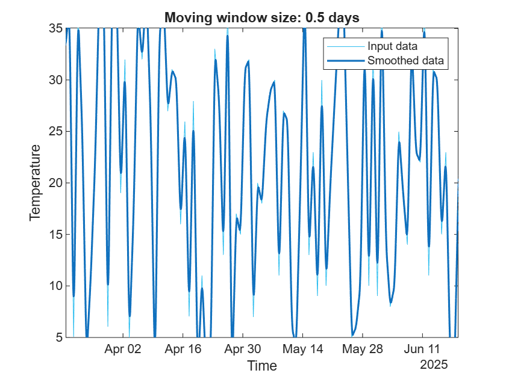

# Data Analysis and AI demo
```matlab
numSamples = 100;
```

```matlabTextOutput
numSamples = 100
```

```matlab
weatherData = generateSyntheticWeatherData(numSamples);
```

```matlab
% Display the first few rows of the generated weather data
disp(head(weatherData));
```

```matlabTextOutput
    Temperature    Humidity    WindSpeed    Label
    ___________    ________    _________    _____

        33            16          13          1  
        37            80           7          3  
         5            31          17          3  
        37            53          11          3  
        25            16           7          3  
         3            60          19          3  
        11            26          18          3  
        22            66          11          3  
```

```matlab
% Visualize the distribution of temperature, humidity, and wind speed
figure;
% Create subplots for each feature
subplot(3, 1, 1);
histogram(weatherData.Temperature, 'FaceColor', 'r', 'EdgeColor', 'k');
title('Temperature Distribution');
xlabel('Temperature (°C)');
ylabel('Frequency');
% Create a subplot for humidity distribution
subplot(3, 1, 2);
histogram(weatherData.Humidity, 'FaceColor', 'b', 'EdgeColor', 'k');
title('Humidity Distribution');
xlabel('Humidity (%)');
ylabel('Frequency');
% Create a subplot for wind speed distribution
subplot(3, 1, 3);
histogram(weatherData.WindSpeed, 'FaceColor', 'g', 'EdgeColor', 'k');
title('Wind Speed Distribution');
xlabel('Wind Speed (km/h)');
ylabel('Frequency');
```


```matlab
% Add time to my weather table
% Add a time variable to the weather data
time = datetime('now') + days(0:numSamples-1)'; % Generate a sequence of dates
weatherData.Time = time; % Add the time variable to the table
% Create a timetable
% Convert the weather data table to a timetable
TT = table2timetable(weatherData)
```


| |Time|Temperature|Humidity|WindSpeed|Label|
|:--:|:--:|:--:|:--:|:--:|:--:|
|1|19-Mar-2025 10:57:38|33|16|13|1|
|2|20-Mar-2025 10:57:38|37|80|7|3|
|3|21-Mar-2025 10:57:38|5|31|17|3|
|4|22-Mar-2025 10:57:38|37|53|11|3|
|5|23-Mar-2025 10:57:38|25|16|7|3|
|6|24-Mar-2025 10:57:38|3|60|19|3|
|7|25-Mar-2025 10:57:38|11|26|18|3|
|8|26-Mar-2025 10:57:38|22|66|11|3|
|9|27-Mar-2025 10:57:38|39|69|13|3|
|10|28-Mar-2025 10:57:38|39|75|12|3|
|11|29-Mar-2025 10:57:38|6|45|4|3|
|12|30-Mar-2025 10:57:38|39|8|6|1|
|13|31-Mar-2025 10:57:38|39|23|9|1|
|14|01-Apr-2025 10:57:38|19|92|4|3|


# Data processing
## Retime
```matlab
% Retime timetable
TT2 = retime(TT,"regular","linear",TimeStep=hours(1))
```


| |Time|Temperature|Humidity|WindSpeed|Label|
|:--:|:--:|:--:|:--:|:--:|:--:|
|1|19-Mar-2025 10:00:00|32.8399|13.4378|13.2402|0.9199|
|2|19-Mar-2025 11:00:00|33.0065|16.1045|12.9902|1.0033|
|3|19-Mar-2025 12:00:00|33.1732|18.7711|12.7402|1.0866|
|4|19-Mar-2025 13:00:00|33.3399|21.4378|12.4902|1.1699|
|5|19-Mar-2025 14:00:00|33.5065|24.1045|12.2402|1.2533|
|6|19-Mar-2025 15:00:00|33.6732|26.7711|11.9902|1.3366|
|7|19-Mar-2025 16:00:00|33.8399|29.4378|11.7402|1.4199|
|8|19-Mar-2025 17:00:00|34.0065|32.1045|11.4902|1.5033|
|9|19-Mar-2025 18:00:00|34.1732|34.7711|11.2402|1.5866|
|10|19-Mar-2025 19:00:00|34.3399|37.4378|10.9902|1.6699|
|11|19-Mar-2025 20:00:00|34.5065|40.1045|10.7402|1.7533|
|12|19-Mar-2025 21:00:00|34.6732|42.7711|10.4902|1.8366|
|13|19-Mar-2025 22:00:00|34.8399|45.4378|10.2402|1.9199|
|14|19-Mar-2025 23:00:00|35.0065|48.1045|9.9902|2.0033|


## Smooth
```matlab
% Smooth input data
[TT3,winSize] = smoothdata(TT2,"movmean",days(0.5), ...
    DataVariables="Temperature");

% Display results
figure
plot(TT2.Time,TT2.Temperature,SeriesIndex=6,DisplayName="Input data")
hold on
plot(TT2.Time,TT3.Temperature,SeriesIndex=1,LineWidth=1.5, ...
    DisplayName="Smoothed data")
hold off
title("Moving window size: " + string(winSize));
legend
ylabel("Temperature")
xlabel("Time")
```



```matlab
clear winSize
```
# Utilities
```matlab
function weatherData = generateSyntheticWeatherData(numSamples)
    % Generate synthetic weather dataset for classification
    % Inputs:
    %   numSamples - Number of samples to generate
    % Outputs:
    %   weatherData - A table containing synthetic weather data

    % Set random seed for reproducibility
    rng(0);

    % Generate synthetic features
    temperature = randi([0, 40], numSamples, 1); % Temperature in degrees Celsius
    humidity = randi([0, 100], numSamples, 1); % Humidity in percentage
    windSpeed = randi([0, 20], numSamples, 1); % Wind speed in km/h

    % Generate synthetic labels based on conditions
    labels = zeros(numSamples, 1);
    for i = 1:numSamples
        if temperature(i) > 30 && humidity(i) < 50
            labels(i) = 1; % Class 1: Hot and dry
        elseif temperature(i) < 10 && humidity(i) > 80
            labels(i) = 2; % Class 2: Cold and wet
        else
            labels(i) = 3; % Class 3: Mild
        end
    end

    % Create a table to hold the data
    weatherData = table(temperature, humidity, windSpeed, labels, ...
        'VariableNames', {'Temperature', 'Humidity', 'WindSpeed', 'Label'});
end
```
